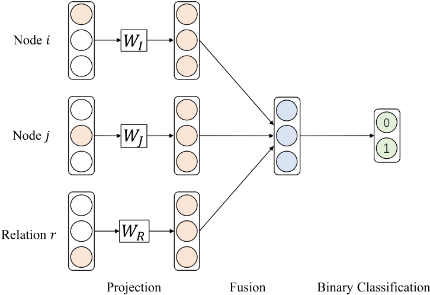
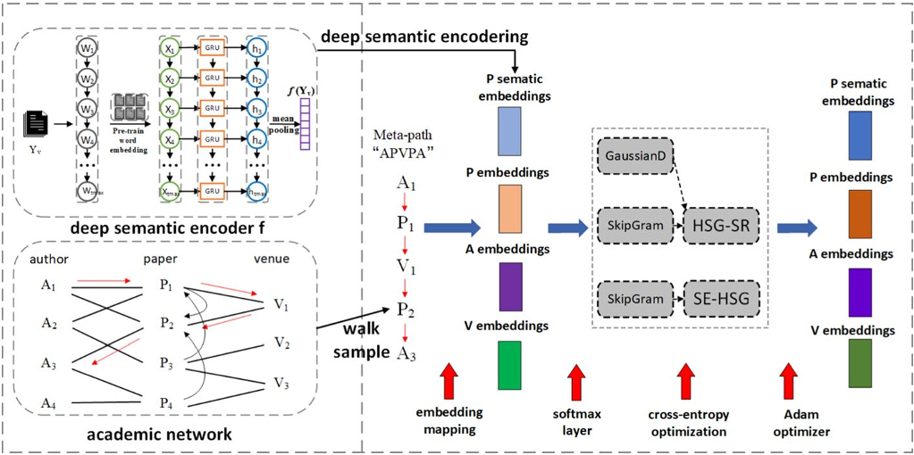
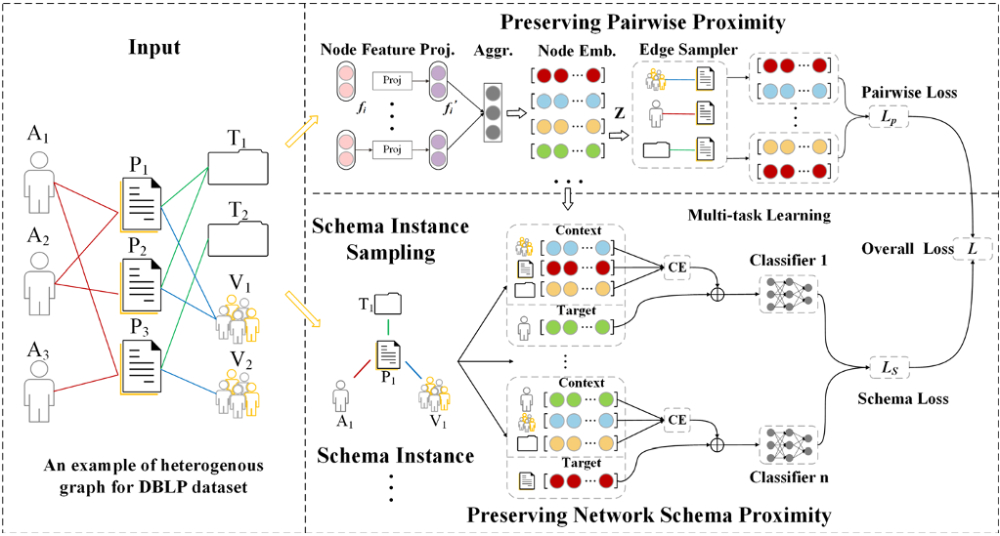
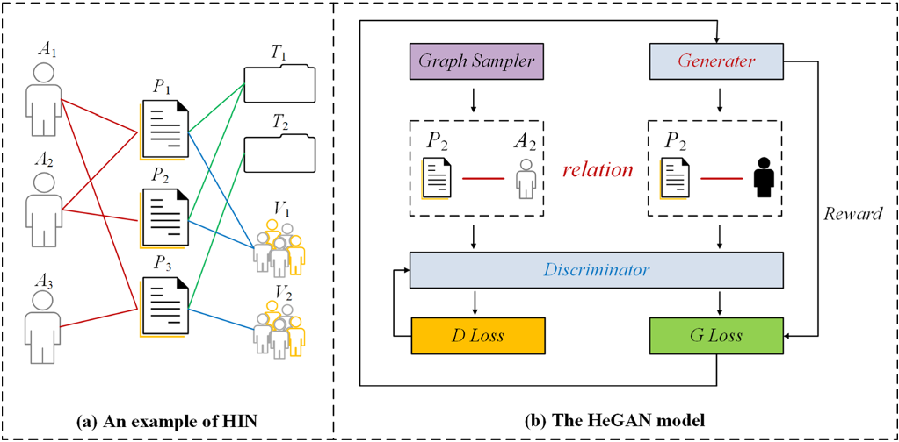
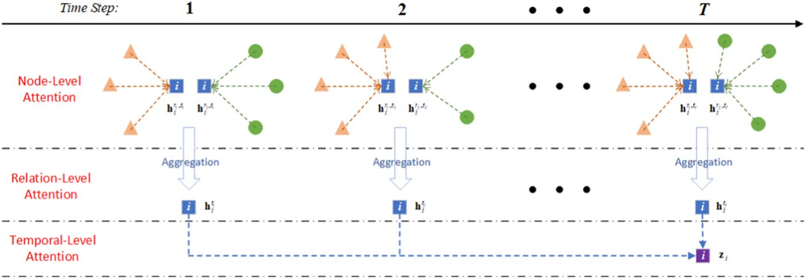

# Introduction

Graphs are widely used to model complex entities and their relationships in various real-life scenarios.

The graph can help people better understand latent information hidden in non-Euclidean data. In order to extract general features of graphs for multiple tasks, graph representation learning (graph embedding) is proposed to capture latent information of the graph and map them into a low dimensional vector space without losing the structural and other information.

Existing graph embedding methods can be categorized as shallow embedding models and deep embedding models.

**Shallow embedding methods**

Shallow embedding methods usually utilize Matrix Factorization (MF) or Random Walk (RW) to learn graph representations.

* The MF-based models learn embedding vectors by constructing matrices and factorizing them according to node pairwise similarities. However, they are quite limited because of time and space costs.
* RW-based approaches learn representations of nodes by sampling nodes sequences. But the RW-based methods need to choose appropriate walk length which is crucial to model performance.

Besides, MF-based and RW-based models both cannot capture high-order nonlinear interaction features.

**Deep embedding methods**

Graph Neural Network (GNN) is proposed to acquire satisfied representation through advanced deep neural networks.

GNN learns node representations by aggregating features of each node's local neighbors without setting node sequences. By stacking multiple network layers with nonlinear activation function, GNN can capture vital high-order interaction information and obtain expressive representations.

Most existing GNN models aim to learning node representations of the homogeneous graph which is composed of single type of nodes and edges. However, in the real world, there are various relationships among different types of entities, and it is hard to describe them in the homogeneous graph.

> Homogeneous Graph is represented as G = (V, E), where V is the node set and E is the edge set between node pairs. Given v ∈ V and e ∈ E to denote the a node and an edge in G. G is associated with a node type mapping function 𝜙(v) ∶ V → A and an edge type mapping function 𝜑(e) ∶ E → R. A and R represent the set of node types and edge types. Without loss of generality, in a homogeneous graph, ∣ A ∣=∣ R ∣= 1.
> 

 In order to capture complex multi-type features and high-order interaction information to obtain expressive representations, researchers have designed several special graph neural networks in recent two years for the heterogeneity preservation. The GNN models for heterogeneous graph are denoted as Heterogeneous Graph Neural Networks (HGNNs).

 > Heterogeneous Graph is also defined as G = (V, E). In heterogeneous graph, at least one of the sets A or R should be of size more than one, that is ∣ A ∣> 1 and/or ∣ R ∣> 1

 > Network Schema is a meta template for a heterogeneous network G = (V, E), defined as S = (A, R), with node type mapping function 𝜙(v) ∶ V → A and edge type mapping function 𝜑(e) ∶ E → R. Network schema is a paradigm used to describe all the node types and edge types in the heterogeneous graph.

 > Metapath is a path P defined on network schema S = (A, R), and is denoted in the form of P = A1$\stackrel{R1}{\longrightarrow}$ A2$\stackrel{R2}{\longrightarrow}$ ⋯ $\stackrel{Rl}{\longrightarrow}$ A l+1, which defines a composite relationR = R1◦R2 ◦ ⋯ ◦Rl between type A1 and Al+1, where ◦ denotes the composition operator on relations.

 > A meta-graph T can be seen as a directed acyclic graph (DAG) composed of multiple meta-paths with common nodes. Formally, meta-graph is defined as T = ($V_T , E_T$), where VT is a set of nodes and ET is a set of links. For any node v ∈ VT , φ(v) ∈ A; for any link e ∈ ET , φ(e) ∈ R.

 > 
 Metapath connected node pair can be regarded as the high-order neighbor with specific semantics. In Fig. c, metapath "APA" represents co-authorship between two authors, and "APVPA" denotes two authors who have papers published at the same conference. We can see that different metapaths indicate different semantic relationships.

 > Heterogeneous Graph Embedding: aims to learn a map function f ∶ V → $ℝ^d$ that converts nodes v ∈ V in heterogeneous graph into a low-dimensional Euclidean space with d ≪∣ V ∣.

 # Methods taxonomy

 ## Shallow graph embedding methods

 ### Random walk-based

 * **[Basic][4305 citations]**[DeepWalk: online learning of social representations(2014)](https://dl.acm.org/doi/abs/10.1145/2623330.2623732)： designed a graph embedding method named DeepWalk. DeepWalk applies random walk to sample node sequences, and then the node sequences are input to Skip-Gram as sentences to learn node embedding.
 * **[4280 citations]**[node2vec: Scalable Feature Learning for Networks(2016)](https://dl.acm.org/doi/abs/10.1145/2939672.2939754): proposed a model called Node2Vec that defines a bias random walk strategy to sample nodes to adapt different graph data.
 *  [Semantic Proximity Search on Heterogeneous Graph by Proximity Embedding(2017)](https://ojs.aaai.org/index.php/AAAI/article/view/10486):  introduce a new concept of proximity embedding and design a proximity embedding.
 * **[Representative work][988 citations]**[metapath2vec: Scalable Representation Learning for Heterogeneous Networks(2017)](https://dl.acm.org/doi/abs/10.1145/3097983.3098036)：uses metapath-guided random walk to capture the semantic information of two nodes
 * [MetaGraph2Vec: Complex Semantic Path Augmented Heterogeneous Network Embedding(2018)](https://link.springer.com/chapter/10.1007/978-3-319-93037-4_16)：uses metagraph to guide the generation of random walks instead of metapath.
 * [Are Meta-Paths Necessary?: Revisiting Heterogeneous Graph Embeddings(2018)](https://dl.acm.org/doi/abs/10.1145/3269206.3271777): proposes a random walk method with Jump and Stay strategies, which can flexibly choose to change or maintain the type of the next node in the random walk without meta-path.
 * [Scalable multiplex network embedding(2018)](https://dl.acm.org/doi/abs/10.5555/3304889.3305089): propose a high-dimensional common embedding and a lower-dimensional additional embedding for each type of relation and uses a skipgram technique to represent information of multi-type relations into a unified space..
 * [HeteSpaceyWalk: A Heterogeneous Spacey Random Walk for Heterogeneous Information Network Embedding(2019)](https://dl.acm.org/doi/abs/10.1145/3357384.3358061): designs a heterogeneous spacey random walk to unify different meta-paths with a second-order hyper-matrix to control the transition probability among different node types.
 * [BHIN2vec: Balancing the Type of Relation in Heterogeneous Information Network(2019)](https://dl.acm.org/doi/abs/10.1145/3357384.3357893): proposes an extended skip-gram technique to balance the various types of relations. It treats heterogeneous graph embedding as a multiple relation-based tasks, and balances the influence of different relations on node embeddings by adjusting the training ratio of different tasks.
 * [Hyperbolic Heterogeneous Information Network Embedding(2019)](https://ojs.aaai.org/index.php/AAAI/article/view/4471): conducts the meta-path guided random walk in hyperbolic spaces, shows that hyperbolic spaces can capture the hierarchical and power-law structure of the heterogeneous graph.

### Decomposition-based approaches

Decomposition-based techniques aim to decompose HG into several sub-graphs and preserve the proximity of nodes in each sub-graph.

* **[429 citations]**[PTE: Predictive Text Embedding through Large-scale Heterogeneous Text Networks(2015)](https://dl.acm.org/doi/abs/10.1145/2783258.2783307): divides the documents into word-word graph, word-document graph and word-label graph. Then it uses [LINE](https://dl.acm.org/doi/abs/10.1145/2736277.2741093) to learn the shared node embeddings for each sub-graph. At last, PTE combines three embedding parts into the final one.
* [Large-Scale Embedding Learning in Heterogeneous Event Data](https://ieeexplore.ieee.org/abstract/document/7837924): samples a series of subgraphs from a HG and preserves the proximity between the center node and its subgraph.
* [Embedding of Embedding (EOE): Joint Embedding for Coupled Heterogeneous Networks(2017)](https://dl.acm.org/doi/abs/10.1145/3018661.3018723): decompose the academic heterogeneous network into two subnetworks. One is called word co-occurrence network and the other is author cooperation network. It embeds node pairs in and between subnetworks respectively.
* [Easing Embedding Learning by Comprehensive Transcription of Heterogeneous Information Networks](https://dl.acm.org/doi/abs/10.1145/3219819.3220006): studied the problem of comprehensive transcription of heterogeneous information networks and proposed the HEER algorithm, which embeds HINs via edge representations that are further coupled with properly-learned heterogeneous metrics.
* **[Representative work][110 citations]**[PME: Projected Metric Embedding on Heterogeneous Networks for Link Prediction(2018)](https://dl.acm.org/doi/abs/10.1145/3219819.3219986): decomposes the heterogeneous graph into some bipartite graphs according to the types of links and projects each bipartite graph into a relation-specific semantic space.
* [Relation Structure-Aware Heterogeneous Information Network Embedding(2019)](https://ojs.aaai.org/index.php/AAAI/article/view/4358): divides the relations into two categories: Affiliation Relations (ARs) and Interaction Relations (IRs). For ARs, a Euclidean distance function is introduced; while for IRs, RHINE proposes a translation-based distance function.

 ## Deep graph embedding methods

 ### Message passing-based approaches

 The idea of message passing is to send the node embedding to its neighbors, which is always used in GNNs. The key component of message passing-based techniques is to design a suitable aggregation function, which can capture the semantic information of HG.

#### Metapath-based

Metapath-based models mainly aim to preserve heterogeneity in graph through constructing metapath based neighbors.

* **[The first to extend GNN to the heterogeneous graph][598 citations]**[Heterogeneous Graph Attention Network(2019)](https://dl.acm.org/doi/abs/10.1145/3308558.3313562): uses a **hierarchical attention mechanism** to capture both node and semantic importance. The whole model can be divided into three parts: **Node-Level Attention aims to learn the importance of neighbors' features. Semantic-Level Attention aims to learn the importance of different metapaths. Prediction layer utilizes the labeled nodes to update the node embeddings.** 
* [HAHE: Hierarchical Attentive Heterogeneous Information Network Embedding(2019)](https://arxiv.org/abs/1902.01475): proposed HAHE model that adopts the same hierarchical structure as HAN to learn the embedding of nodes. The difference is that HAHE **uses cosine similarity instead of attention mechanism to calculate the two kinds of importance**.
* **[151 citations]**[MAGNN: Metapath Aggregated Graph Neural Network for Heterogeneous Graph Embedding(2020)](https://dl.acm.org/doi/abs/10.1145/3366423.3380297): employs three major components, i.e., **the node content transformation to encapsulate input node attributes, the intra-metapath aggregation to incorporate intermediate semantic nodes, and the inter-metapath aggregation to combine messages from multiple metapaths.** Differing from the node-level aggregation in HAN, node-level aggregation in MAGNN aggregates all nodes in metapaths rather than two end nodes of the path. 

#### Relation-based

The relation-based methods can learn node representations by aggregating the features of one-hop neighbor without setting metapath artificially.

* **[451 citations]** [Graph Transformer Networks(2019)](https://proceedings.neurips.cc/paper/2019/hash/9d63484abb477c97640154d40595a3bb-Abstract.html): learns nodes embeddings by **automatically finding useful metapaths**. It separates the heterogeneous graph into several subgraphs according to relation types and feeds subgraph adjacency matrices into multi-channel [GCN](https://arxiv.org/abs/1609.02907) to learn node embeddings. But GTN only considers edge types with ignoring different types of nodes.
* **[Representative work of unsupervised HGNNs][317citations]** [Heterogeneous Graph Neural Network(2019)](https://dl.acm.org/doi/abs/10.1145/3292500.3330961): It **consists of three parts: content aggregation, neighbor aggregation and type aggregation**. Content aggregation is designed to learn fused embeddings from different node contents, such as images, text or attributes. Neighbor aggregation aims to aggregate the nodes with same type by using a Bi-LSTM to capture the position information. Type aggregation uses an attention mechanism to mix the embeddings of different types and produces the final node embeddings. Finally, a heterogeneous skip-gram loss is used as the unsupervised graph context loss to update the node embeddings. Through the three aggregation methods, HetGNN can **preserve the heterogeneity of both graph structures and node attributes**.
* **[157 citations]** [Representation Learning for Attributed Multiplex Heterogeneous Network(2019)](https://dl.acm.org/doi/abs/10.1145/3292500.3330964): Compared with HetGNN, GATNE pays more attention to distinguishing different link relationships between the node pairs.
* **[98 citations]**[An Attention-based Graph Neural Network for Heterogeneous Structural Learning.(2020)](https://ojs.aaai.org/index.php/AAAI/article/view/5833)：developed a metapath-free embedding model called Heterogeneous Graph Structural Attention Neural Network (HetSANN) to learn each node embedding by **aggregating neighbors with relation importance**. Firstly, HetSANN selects a node with its neighbors and projects neighbor nodes into the selected node space. Afterward, HetSANN apply the graph neural network to aggregate multi-relational information of projected neighborhood by means of attention mechanism.
* **[212 citations]**[Heterogeneous Graph Transformer(2020)](https://dl.acm.org/doi/abs/10.1145/3366423.3380027): **designed node- and edge-type dependent parameters to characterize the heterogeneous attention over each edge**. It defines a meta relation triplet attention mechanism to calculate neighbors' importance scores with edge information as the weights of passed messages.
* [Interpretable and Efficient Heterogeneous Graph Convolutional Network(2021)](https://ieeexplore.ieee.org/abstract/document/9508875): proposed an Interpretable and Efficient Heterogeneous Graph Convolutional Network (ie-HGCN) to learn heterogeneous graph embedding by using a node type distinguished GCN. It is **designed as a hierarchical aggregation architecture, i.e., object-level aggregation and type-level aggregation**. Firstly, ie-HGCN **projects the representation of different types of neighbor nodes into a common semantic space**. It considers the heterogeneous graph is composed of multiple bipartite graphs and uses [GCN](https://arxiv.org/abs/1609.02907) for bipartite graphs in object-level aggregation. In type-level aggregation, ie-HGCN obtains finally node embeddings by utilizing attention to **aggregate different types of neighbor nodes**. The ie-HGCN effectively reduces computational consumption by multiplying block matrices.

Compared with the methods of artificially defining metapaths, the relation-based methods can select the most useful metapath for the current task and dataset by comparing the importance scores between different types of nodes in each network layer, so as to provide support for the interpretability of the model. However, the relation-based methods have more model parameters, which increases the space consumption.

#### Others

* [Relation Structure-Aware Heterogeneous Graph Neural Network(2019)](https://ieeexplore.ieee.org/abstract/document/8970828): a unified model that **integrates graph and its coarsened line graph** to embed both nodes and edges in heterogeneous graphs without requiring any prior knowledge such as metapath. RSHN **first creates a Coarsened Line Graph Neural Network (CL-GNN) to excavate edge-centric relation structural features that respect the latent associations of different types of edges based on coarsened line graph**. After that, **a Heterogeneous Graph Neural Network (H-GNN) is used to leverage implicit messages from neighbor nodes and edges propagating among nodes in heterogeneous graphs**. As a result, different types of nodes and edges can enhance their embedding through mutual integration and promotion.
* [Heterogeneous Graph Structure Learning for Graph Neural Networks(2021)](https://ieeexplore.ieee.org/abstract/document/9508875): proposed Heterogeneous Graph Structure Learning (HGSL) that is **first attempt to study heterogeneous graph structure**. HGSL generates three relation subgraph independently. HGSL not only considers the feature similarity by generating **feature similarity graph**, but also considers the complex heterogeneous interactions in features and semantics by generating **feature propagation graph and semantic graph**. Then, these graphs are **fused to a learned heterogeneous graph and optimized together with a GNN** towards classification objective.
* [Heterogeneous Hyper-Network Embedding(2018)](https://ieeexplore.ieee.org/abstract/document/8594913): presented a deep learning method HHNE for embedding **heterogeneous attribute hypergraph**. HHNE uses fully connected layers and graph convolution layers to project multi-type nodes into a common low-dimensional space. A tuple-wise similarity function is proposed to preserve the network structure, and a ranking based loss function is used to improve the similarity scores of hyperedges in the embedding space.

 

### Autoencoded-based approaches

The main purpose of autoencoder-based methods is to use neural network as encoders to learn node embedding from node structure and/or attributes, and design decoders to retain structural and/or attributes information in original graph to the greatest extent.

**Structure preserved only**

Structure preserved model usually embed heterogeneous graph without node attribute information. They only need to maintain the graph topological information.

* **[Typical hybrid relation-based graph embedding method][249 citations]** [HIN2Vec: Explore Meta-paths in Heterogeneous Information Networks for Representation Learning(2017)](https://dl.acm.org/doi/abs/10.1145/3132847.3132953)：By **fusing the one-hot vectors of metapaths and nodes through feed-forward neural network**, HIN2vec carries out multiple relation prediction tasks jointly to learn the embeddings of nodes and meta-paths. The purpose of HIN2vec is to **predict whether two nodes are connected by a meta-path**, which can be seen as a multilabel classification task. 
* **[Typical hyperedge-based graph embedding method][151 citations]** [Structural Deep Embedding for Hyper-Networks(2018)](https://ojs.aaai.org/index.php/AAAI/article/view/11266): DHNE aims to learn representation of hypergraph with indecomposable hyperedges. DHNE **feed each hyperedge into autoencoders** and these autoencoders are used to learn embedding of nodes. Afterwards, DHNE **develops a tuple-wise similarity function to preserve local and global proximities** and optimize neural network.
* **[171 citations]** [SHINE: Signed Heterogeneous Information Network Embedding for Sentiment Link Prediction(2018)](https://dl.acm.org/doi/abs/10.1145/3159652.3159666): It uses heterogeneous graph to represent complex relationships of users and **divides the constructed heterogeneous graph into three subgraphs to obtain different semantic information**. Afterwards, SHINE **utilizes three autoencoders to embed the three subgraphs into low-dimensional vectors and aggregates three embeddings as heterogeneous graph representation for link prediction**. Finally, **a decoder is used to minimize reconstruction error** for optimizing neural network. SHINE utilizes the topological structure of heterogeneous graphs to achieve emotion prediction that can **predict a user's emotions to other users**.

**Structure and attributes preserved**

In the attribute heterogeneous graph, attribute information is usually attached to nodes. It makes the same type of nodes may have dissimilar embedding vectors because each node has different attribute features. Therefore, attribute heterogeneous graph embedding not only preserves the topological information of the graph but also distinguishes the differences of attributes on the nodes.

* **[315 citations]** [Heterogeneous Network Embedding via Deep Architectures(2015)](https://dl.acm.org/doi/abs/10.1145/2783258.2783296): designed Heterogeneous Network Embedding (HNE) to embed heterogeneous graph consisting of images and texts as nodes. HNE **adopts Convolution Neural Network (CNN) and fully connected layers to extract image and text features**. It **uses two transformation matrices as encoders to project different dimensional features into a common space as node embeddings**. Afterwards, HNE **designs node similarity function as loss function to optimize model**.
* [BL-MNE: Emerging Heterogeneous Social Network Embedding Through Broad Learning with Aligned Autoencoder(2017)](https://ieeexplore.ieee.org/abstract/document/8215533): developed DIME to embed users in sparse social network. For addressing sparsity in an emerging social network, DIME **defines multiple attribute augmented metapaths to capture various semantic information between users**. It **uses autoencoders to learn users' embedding on each metapath** and **fuses all metapaths based embeddings together** to get complete users' representations.
* [SHNE: Representation Learning for Semantic-Associated Heterogeneous Networks(2019)](https://dl.acm.org/doi/abs/10.1145/3308558.3313537): SHNE aims to embed nodes with **aggregating structural information and semantic information from text data**. SHNE utilizes metapaths and gated recurrent units ([GRU](https://arxiv.org/abs/1412.3555)) to extract heterogeneous structural and text attribute information. It **uses heterogeneous Skip-Gram model as the encoder to learn node embeddings**. 
* [Network Schema Preserving Heterogeneous Information Network Embedding(2020)](https://par.nsf.gov/biblio/10215834): is first attempt to **utilize Network Schema instead of meta-path to embed heterogeneous graph** with keeping pairwise structure and network schema structure at the same time. Firstly, NSHE **utilizes GCN to learn node embedding for preserving first order proximity**. Then, it **designs multi-task learning which multiple autoencoders are used to learn node embedding from network schema instances**, and the learned embeddings are optimized by a prediction task. 

Different from the convolution-based models, the autoencoder-based models do not use any supervised signals, they learn the representations of nodes in an unsupervised encoder-decoder architecture and optimizes the model through reconstructing errors. This enables the autoencoder-based models to be applied to more tasks and application scenarios than convolution-based models.

### Adversarial-based approaches

The adversarial-based methods mainly utilize [Generative Adversarial Network (GAN)](https://dl.acm.org/doi/abs/10.1145/3422622) to learn robust node embedding through adversarial training between generator and discriminator. The existing adversarial-based methods use relationship between node pair to determine the true or fake nodes. It means that adversarial-based methods only maintain the interaction information in the heterogeneous graph and ignore node attributes.

* **[69 citations]** [Adversarial Learning on Heterogeneous Information Networks(2019)](https://dl.acm.org/doi/abs/10.1145/3292500.3330970): designed a heterogeneous graph embedding framework, HeGAN, to embed heterogeneous graph based on adversarial principle. In order to adapt to the heterogeneous environment, it **extends the discriminator and generator to associate with relation perception. Specifically, for a given relationship, a node is true or fake is determined by discriminator, and the generator can generate a false node to simulate true node.** 
* [Deep Adversarial Completion for Sparse Heterogeneous Information Network Embedding(2020)](https://dl.acm.org/doi/abs/10.1145/3366423.3380134): For learning node embedding **in incomplete heterogeneous graph**, proposed Multi View Adversarial Completion Model (MV-ACM). According to multi-view architecture, MV-ACM **applies adversarial learning to capture complementary information of each node** via different type relationships for complete and robust node representations. Specifically, **generator tries to generate most complementary views to complete information of each node in each view, and discriminator tries to discriminate whether the generated view is complementary of each node in each view**. After performing minimax game between generator and discriminator, generator can learn latent reciprocity for each relationship. Finally, MV-ACM fuses learned reciprocity with original view representation together to obtain complementary representations.

Different from the two kinds of methods mentioned above, which are discriminant methods, the adversarial-based methods belong to deep generative model that aim to generate node embeddings by adversarial training. In this way, adversarial-based methods can obtain more robust representations through iteratively generative adversarial optimization.

## Dynamic heterogeneous graph learning

Different from the regular static heterogeneous graph, the dynamic heterogeneous graphs will evolve over the time, i.e. the entities and interactions in the graph will change with the time evolution.

### Independent learning‑based approaches

This kind of methods regard the input dynamic graph at each time slice as a static graph and learns its representation, and then aggregate the graph representations of all time slices to form a dynamic graph representation that integrates the temporal information.

* [Dynamic Heterogeneous Graph Embedding Using Hierarchical Attentions(2020)](https://link.springer.com/chapter/10.1007/978-3-030-45442-5_53): proposed a dynamic HGNN model called DyHAN Similar with HAN, DyHAN also **utilizes hierarchical attention to extract the complex heterogeneity**. But the main difference between HAN and DyHAN is that the DyHAN **uses an additional attention layer to learn the evolution information over time of dynamic heterogeneous graphs**. DyHAN **uses [Dot-Product Attention](https://proceedings.neurips.cc/paper/2017/hash/3f5ee243547dee91fbd053c1c4a845aa-Abstract.html) to formulate importance of each time step**. 
* [Modeling Dynamic Heterogeneous Network for Link Prediction Using Hierarchical Attention with Temporal RNN(2020)](https://link.springer.com/chapter/10.1007/978-3-030-67658-2_17): DyHATR also **uses hierarchical attention to maintain the heterogeneity in graphs**. However, the main difference between DyHATR and DyHAN is that DyHATR **uses RNN to discover the vital evolution information over time**.
* [DyHGCN: A Dynamic Heterogeneous Graph Convolutional Network to Learn Users’ Dynamic Preferences for Information Diffusion Prediction(2021)](https://link.springer.com/chapter/10.1007/978-3-030-67664-3_21): It **utilizes GCN to learn node embeddings under each relation, and aggregate embedding from different relations through a heuristic strategy**, instead of hierarchical attention used in DyHAN and DyHATR. For capturing temporal evolution, DyHGCN also **uses self-attention to fuse learned features from each time step**. And the fused embeddings will be utilized to **predict information diffusion**.

The independent learning-based models essentially utilize the hierarchical attention to learn the dynamic heterogeneous graph representations. Compared with HAN, HGT and other hierarchical attention models for static graphs, the independent learning-based models have an additional attention mechanism to capture the information of temporal evolution. But this kind of architecture will lead to high computational consumption.

### Incremental learning‑based approaches

Different from the independent learning-based methods that learn representations for each time step, the incremental learning-based models only updates the node embeddings which affected by time changes,rather than learning the whole graph on each time slice.

* [Network Embedding and Change Modeling in Dynamic Heterogeneous Networks(2019)](https://dl.acm.org/doi/abs/10.1145/3331184.3331273): Change2Vec extends the heterogeneous Skip-Gram used in Metapath2Vec to dynamic heterogeneous graph learning. It **designs four nodes evolution scenarios for modeling dynamic changes and leverages the Metapath2Vec to learn the embeddings of changed nodes**.
* [Relationship Prediction in Dynamic Heterogeneous Information Networks(2019)](https://link.springer.com/chapter/10.1007/978-3-030-15712-8_2): uses the incremental update on the matrix factorization of HG.
* [Dynamic Heterogeneous Information Network Embedding With Meta-Path Based Proximity(2020)](https://ieeexplore.ieee.org/abstract/document/9091208): DyHNE is an incremental learningbased method which learns node embeddings while **considering both the heterogeneity and evolution information relied on the theory of matrix perturbation**. DyHNE maintains the heterogeneity through **preserving first-order and second-order metapath proximities**. DyHNE preserves both the structural and semantic information of HG and uses the perturbation of matrix to capture the evolution of HG over time

The incremental learning-based models usually learning representations through several traditional techniques, such as matrix factorization or random walk-based shallow learning frameworks. This kind of learning approaches strictly are not involved in HGNN models. Therefore, how to extend incremental learning framework to deep HGNN models is a vital research problem for achieving efficient learning schema.

